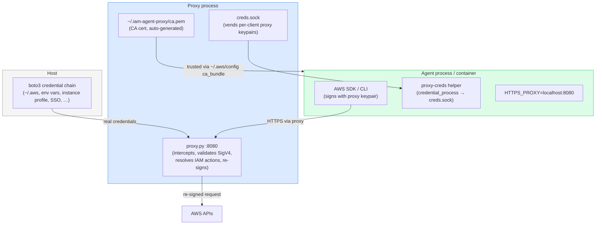

# Credential injection proxies for AWS agents

_Title: Credential injection proxies for AWS agents_  
_Meta description: A proxy that holds real AWS credentials, gives agents fake keys, and re-signs outbound requests — so agents can never leak what they don't have._  
_Tags: aws, iam, ai-agents, security, credential-isolation_  
_Reading time: ~7 min_

---

There's a class of security tool worth naming: the credential injection proxy. The idea is simple. Rather than giving a workload real credentials, you give it a placeholder that authenticates it to a proxy. The proxy swaps in real credentials at request time. The workload can operate normally; the real credentials never appear in its environment, its logs, or its context window.

Tools like [OneCLI](https://www.onecli.sh), [AgentVault](https://github.com/Infisical/agent-vault), and [tokenizer](https://github.com/superfly/tokenizer) follow this shape for API keys and bearer tokens. The swap is simple: intercept the outbound request, replace the Authorization header, forward it. For most third-party APIs, that's the whole implementation.

AWS doesn't work that way. AWS requests are signed with SigV4 — HMAC-SHA256 over the method, host, path, query string, headers, and body hash. The signature is bound to the exact request. You can't replace a credential after signing; the signature will be wrong. Any proxy that wants to inject AWS credentials has to do it before signing — which means giving the agent fake-but-valid credentials to sign with, then stripping and recomputing the signature on the way out.

This is the strip-and-resign pattern. I built an implementation of it, and this post covers how it works, what it gets you beyond credential isolation, and where the limits are.

## The architecture

The proxy runs as a single Python process. [proxy.py](https://github.com/abhinavsingh/proxy.py) handles TLS interception using a CA cert it generates on first run. boto3 supplies real credentials via the standard credential provider chain — whatever is configured on the host works. There is no separate credential daemon, no subprocess, and no venv isolation required.

The agent never sees the real IAM credentials. It holds proxy-issued fake keypairs — syntactically valid, no IAM identity behind them. If they show up in a prompt, a log, or an exfiltrated file, they're useless: AWS rejects them immediately. The proxy is the only entity that can do anything meaningful with them.

## Why I needed this: IAM Identity Center roles

The immediate motivation was an IAM Identity Center constraint. IAC roles live under `/aws-reserved/` and return `UnmodifiableEntity` on any attempt to modify their trust policy. Self-assumption is blocked. Session policies — which let you scope down permissions at `AssumeRole` time — require an intermediate `AssumeRole` call the trust policy must permit, which it doesn't.

The usual pattern for giving an agent scoped access to an IAM role (assume the role with an inline session policy, hand the resulting credentials to the agent) doesn't work here. The role is locked down by AWS and you can't change that.

The proxy is the workaround. The host machine already has IAC credentials (via IAM Identity Center SSO, an instance profile, or a credential file). The proxy re-signs the agent's outbound requests with those credentials. The agent authenticates to the proxy; the proxy authenticates to AWS. The agent never touches the real credentials.

## The strip-and-resign flow

Here's what happens when the agent makes an AWS API call:

1. The agent's AWS SDK needs credentials to sign the request. It calls `proxy-creds`, a small helper wired up via `credential_process`. `proxy-creds` connects to `creds.sock` and retrieves the current proxy keypair.

2. The SDK signs the request with the proxy keypair and sends it to `HTTPS_PROXY`.

3. proxy.py terminates TLS using its CA cert (which the AWS SDK trusts via `ca_bundle` in `~/.aws/config`) and hands the plaintext request to the plugin.

4. The plugin validates the SigV4 signature locally — HMAC-SHA256 against the held secret — without calling AWS. Requests signed with unknown or mismatched keys are rejected with a forged `InvalidClientTokenId` 403 before any real credential fetch happens.

5. On success, the plugin strips all SigV4 headers (`Authorization`, `X-Amz-Date`, `X-Amz-Security-Token`, `X-Amz-Content-Sha256`), fetches fresh credentials via `boto3.Session().get_credentials()`, and recomputes the signature.

6. The re-signed request goes to the AWS endpoint.

The local validation step matters. Without it, anything with access to `creds.sock` could submit arbitrary requests and the proxy would re-sign them with real credentials. The SigV4 check ties each request to a specific client identity before any real credential is used.

## What you get beyond credential isolation

Credential isolation is the baseline. The more interesting property is that the proxy is the only signer — and that has consequences.

**Behavioral least privilege.** Once you're intercepting every signed request, you can resolve each one to IAM action strings and log them. Running the agent against a representative workload produces a behavioral profile: what the agent actually called, not what someone guessed it would call. That's the input to a least-privilege policy.

The proxy operates in two modes. In recording mode, all validated requests are forwarded and the proxy logs the resolved IAM actions. In enforcement mode, those same actions are checked against an IAM policy JSON allowlist. Anything not on the list gets a forged `AccessDenied` 403 — indistinguishable from a real IAM denial from the agent's perspective.

The workflow is: run in recording mode, review the log, edit out anything unexpected, switch to enforcement mode. The allowlist reflects actual usage. The enforcement boundary catches deviation from that baseline — whether from legitimate new behavior, a changed prompt, or a prompt injection attempt.

**The agent can't expand its own permissions.** An agent that holds long-lived role credentials can call `AssumeRole` itself, attach whatever session policy it wants, and broaden its access. An agent talking through this proxy can't: it has no signing material and never sees the real credentials. The proxy is what controls what reaches AWS.

**Proxy denials show up where CloudTrail doesn't.** CloudTrail records what AWS authorized. The proxy records what the agent attempted, including calls that the proxy blocked before they reached AWS. That gap matters when you're trying to baseline agent behavior or investigate a prompt injection that asked for something it shouldn't have.

## Existing AWS-aware proxies

There are a few. AWS publishes [aws-sigv4-proxy](https://github.com/awslabs/aws-sigv4-proxy). Envoy has an [aws_request_signing filter](https://www.envoyproxy.io/docs/envoy/latest/configuration/http/http_filters/aws_request_signing_filter). These work for unsigned callers — curl scripts, custom HTTP clients — where the proxy adds the signature on the way out. They don't work for the AWS CLI or any AWS SDK, because those sign before they hit the network. By the time the request reaches the proxy, it's already signed with whatever credentials the caller had. The proxy can't add a signature on top; it has to strip and recompute.

AWS's [mcp-proxy-for-aws](https://github.com/aws/mcp-proxy-for-aws) is solving a different problem — bridging MCP transport to IAM auth — and it pulls credentials from the standard chain on the same machine the agent runs on. Credential isolation isn't the goal there.

The strip-and-resign pattern is the gap. It requires the proxy to: vend credentials the agent can sign with, validate those signatures locally, strip them, and recompute with real credentials. That combination is what makes it work with the AWS CLI and SDKs.

## Honest limits

The proxy doesn't handle SigV4a (multi-region access points) or streaming payload signing (large S3 uploads). It's not a replacement for CloudTrail — they're complementary. It doesn't prevent prompt injection; it catches the resulting API calls if they exceed the allowlist.

The IAM action resolver covers the major wire protocols (JSON, query, REST-JSON, REST-XML) and resolves against a ~19k-entry action map derived from botocore service models. Edge cases exist.

Enforcement mode is the newest piece and still evolving. The recording-to-enforcement workflow is straightforward; the allowlist format is standard IAM policy JSON.

## Try it

The implementation is at [github.com/engseclabs/aws-sigv4-resigning-proxy](https://github.com/engseclabs/aws-sigv4-resigning-proxy). Install with `pip install proxy.py botocore boto3 cryptography pydantic` — no dependency conflicts, no separate venvs. The README covers setup and configuration. DESIGN.md has the full architecture rationale, including the credential carrier pattern, Docker isolation as an enforcement boundary, and the behavioral least-privilege model in detail.

If you're building something in this space or hit a case this doesn't cover, [reach out](https://engseclabs.com/).
