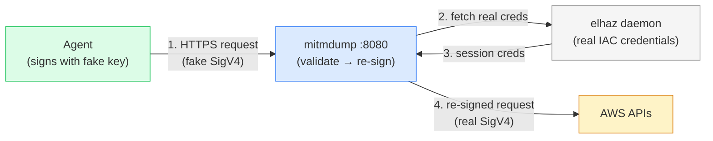
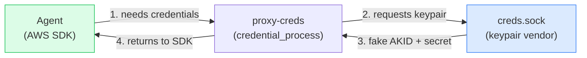
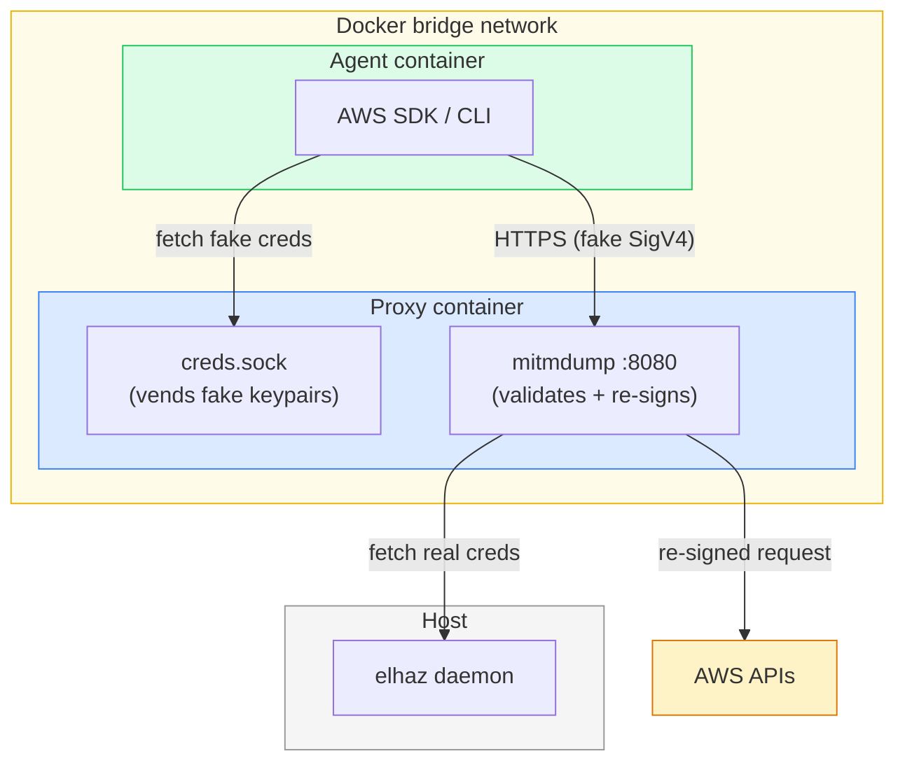

# iam-agent-proxy

A **credential injection proxy** for AWS: the agent holds proxy-issued fake AWS keys with no IAM identity, and the proxy re-signs outbound requests with real credentials the agent never sees. Isolation is a property of the environment, not the agent — the agent cannot misuse credentials it does not hold.

This uses [mitmproxy](https://mitmproxy.org/) under the hood, with [elhaz](https://github.com/61418/elhaz) as the IAM Identity Center credential source. See the [blog post](./BLOG.md) for the conceptual background on credential injection proxies as a pattern.

## Why this exists

**Credential protection and prompt injection resistance** — an AI agent that holds real AWS credentials can be manipulated into leaking them or using them in unintended ways. Prompt injection is a real attack: if the agent reads attacker-controlled content (a document, a web page, a database row), that content can instruct the agent to exfiltrate its credentials or call arbitrary AWS APIs. The proxy eliminates this risk by ensuring the agent never holds credentials at all. It gets a proxy-issued keypair that has no IAM identity and is useless outside the proxy. Even a fully compromised agent cannot leak credentials it was never given.

**Least-privilege policy generation** — the hardest part of scoping an agent's IAM permissions is knowing what it actually needs. Guessing produces overly broad policies; auditing code is error-prone and misses runtime behavior. The proxy resolves every outbound AWS request to its exact IAM action(s) and logs them. Run the agent against a representative workload and you get a precise, observed permission set — not an estimate.

**IAM Identity Center roles are unmodifiable** — for teams using AWS IAM Identity Center, there is an additional constraint: IAC roles live under `/aws-reserved/` and return `UnmodifiableEntity` on any attempt to modify their trust policy. Session policies are also unreachable because the trust policy only permits `sts:AssumeRoleWithSAML`. The proxy is the workaround: it holds an [elhaz](https://github.com/61418/elhaz) session for the IAC role and re-signs outbound requests, so the agent authenticates to the proxy rather than directly to AWS.

## How it works

There are two things going on inside the proxy: it vends fake credentials to the agent, and it rewrites outbound requests to use real ones. Here they are separately, then together.


### 1. Request interception and re-signing

When the agent makes an AWS API call, the request goes through `mitmdump` (HTTPS proxy on port 8080). mitmdump validates the SigV4 signature locally using the secret it issued, then strips that signature and re-signs the request with real credentials fetched from elhaz.



If the inbound signature doesn't validate (unknown access key, mismatched HMAC), mitmdump returns a forged `InvalidClientTokenId` 403 without ever calling elhaz. In enforce mode, it also resolves the request to its IAM action and returns a forged `AccessDenied` 403 if the action isn't on the allowlist.

### 2. Credential replacement

The agent never sees real AWS credentials. The proxy generates fake-but-syntactically-valid keypairs and hands them out over a Unix socket. The agent's SDK signs requests with these fake keys, exactly as it would with real ones.



The fake keypair has no IAM identity behind it. AWS would reject it. It only works because the proxy is going to swap it out before the request leaves.


### 3. Putting it together

Both flows live in the same proxy container, on a Docker bridge network the agent shares but cannot escape. The agent's only path to AWS is through mitmdump.



The agent container has no access to the elhaz socket and no IAC credentials of its own. It only sees `creds.sock` (fake keypairs) and the mitmdump port. Real credentials never cross the container boundary.

## Quickstart

### Prerequisites

- Docker and Docker Compose
- [elhaz](https://github.com/61418/elhaz) installed, daemon running, and the target role added

```bash
elhaz daemon start
elhaz daemon add -n sandbox-elhaz   # or whatever IAC role the agent should use
```

### Step 1 — start the stack

Open two terminal panes. In the first, start the proxy and tail its action stream:

```bash
ELHAZ_CONFIG_NAME=sandbox-elhaz docker compose up --build proxy
```

You'll see mitmproxy start and log lines as requests come in. Keep this pane visible — resolved IAM actions are logged here and written to `/run/proxy/actions.log` inside the container.

### Step 2 — run an integration test (one-liner)

To verify the stack is working end-to-end, run a command directly in a throwaway agent container:

```bash
docker compose run --rm agent aws sts get-caller-identity
```

Expected output:

```json
{
    "UserId": "AROAEXAMPLE:boto3-refresh-session",
    "Account": "123456789012",
    "Arn": "arn:aws:sts::123456789012:assumed-role/YourRole/boto3-refresh-session"
}
```

If you see this, credentials are flowing: proxy keypair → local SigV4 validation → elhaz re-sign → AWS. A `ServiceUnavailable` response means the proxy can't reach the elhaz daemon (check `elhaz daemon status` and that the session is listed in `elhaz daemon list`).

### Step 3 — drop into an interactive agent shell

For longer sessions, open an interactive shell in the agent container:

```bash
docker compose run --rm agent bash
```

The container has `AWS_PROFILE`, `HTTPS_PROXY`, and `AWS_CA_BUNDLE` pre-configured. Run any AWS commands and watch the proxy pane:

```bash
aws sts get-caller-identity
aws s3 ls
aws iam get-role --role-name MyRole
```

In the proxy pane you'll see lines like:

```
[14:32:01] ALLOWED  sts:GetCallerIdentity
[14:32:09] ALLOWED  s3:ListAllMyBuckets
[14:32:15] ALLOWED  iam:GetRole
```

Each line is a distinct IAM action the agent actually called — not a guess.

### Step 4 — extract the policy

When you're done running commands, generate a least-privilege policy from everything observed so far:

```bash
get-policy
```

Output:

```json
{
  "Version": "2012-10-17",
  "Statement": [
    {
      "Sid": "ProxyRecordedActions",
      "Effect": "Allow",
      "Action": [
        "iam:GetRole",
        "s3:ListAllMyBuckets",
        "sts:GetCallerIdentity"
      ],
      "Resource": "*"
    }
  ]
}
```

Pipe it to a file, tighten the `Resource` fields, and it's ready to use as an IAM policy or a session policy.

### Tear down

```bash
docker compose down     # stops containers, keeps volumes (CA cert, action log)
docker compose down -v  # stops containers and removes volumes
```

## How the containers are wired

```
host
├── elhaz daemon  ←─── ~/.elhaz/sock/daemon.sock (bind-mounted into proxy)
│
├── proxy container
│   ├── mitmdump :8080          — intercepts, validates SigV4, resolves IAM actions, re-signs
│   ├── elhaz (in /opt/elhaz-venv) — fetches IAC credentials via mounted socket
│   ├── /run/proxy/creds.sock   — vends per-client proxy keypairs (named volume)
│   └── /run/mitmproxy/         — CA cert (named volume)
│
└── agent container
    ├── AWS SDK / CLI           — signs requests with proxy keypair
    ├── proxy-creds             — credential_process helper reads creds.sock
    ├── HTTPS_PROXY=proxy:8080  — routes all AWS traffic through proxy
    └── (no elhaz socket, no IAC credentials)
```

The agent is on an internal Docker bridge network. Its only internet egress is through the proxy container.

> **Note on dependencies:** mitmproxy 12.x and elhaz 0.5.x have an irreconcilable `typing-extensions` version conflict. The proxy image resolves this by installing elhaz in a separate venv (`/opt/elhaz-venv`) and symlinking its binary onto `PATH`. They never share a Python environment.

## Configuration

| Env var | Default | Description |
|---|---|---|
| `ELHAZ_CONFIG_NAME` | `sandbox-elhaz` | elhaz config name for the IAC role |
| `ELHAZ_SOCK` | `~/.elhaz/sock/daemon.sock` | Host path to the elhaz daemon socket |
| `ELHAZ_CONFIG_DIR` | `~/.elhaz/configs` | Host path to elhaz config files |
| `ELHAZ_SOCKET_PATH` | `/tmp/elhaz.sock` | Socket path inside the proxy container |
| `PROXY_SOCK_PATH` | `/run/proxy/creds.sock` | Unix socket path for credential vending |
| `PROXY_KEYPAIR_TTL` | `3600` | Proxy keypair lifetime in seconds |
| `PROXY_MODE` | `record` | `record` (forward all) or `enforce` (check allowlist) |
| `ALLOWLIST_PATH` | *(required in enforce mode)* | Path to IAM policy JSON allowlist |

Override defaults in `.env` or by prefixing `docker compose up`:

```bash
ELHAZ_CONFIG_NAME=my-agent-role docker compose up -d
```

## Switching to enforcement mode

After running the agent in recording mode, collect the observed actions and author an allowlist:

```bash
# Pull resolved actions from proxy logs
docker compose logs proxy | grep "Resolved actions" > actions.txt

# Author a policy.json from the observed actions, then:
PROXY_MODE=enforce ALLOWLIST_PATH=/path/to/policy.json docker compose up -d
```

The `ALLOWLIST_PATH` file is standard IAM policy JSON — the same format you'd pass to `aws iam put-role-policy`. Enforcement mode is still evolving; see [DESIGN.md](./DESIGN.md) for the full rationale.

## Appendix: why IAM Identity Center roles require a proxy

AWS IAM Identity Center roles live under `/aws-reserved/` and return `UnmodifiableEntity` on any attempt to modify their trust policy. The trust policy allows only `sts:AssumeRoleWithSAML` from the SAML provider — self-assumption is blocked. Session policies (which require an `AssumeRole` call the trust policy must permit) are also unreachable.

The proxy is the workaround: it holds an elhaz session for the IAC role and re-signs outbound requests. The agent authenticates to the proxy, not to AWS directly.

See [DESIGN.md](./DESIGN.md) for the full architecture and design rationale.
