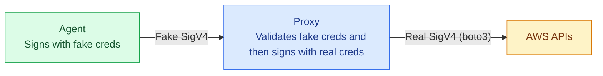
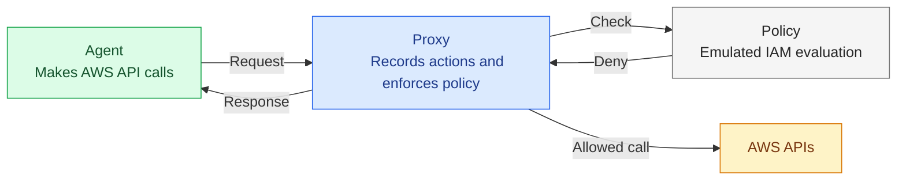

# IAM Agent Proxy

> Isolate credentials as a *credential injection proxy* and stop worrying about exfiltration through prompt injection.

> Then, observe and lockdown IAM permissions with *least privilege guardrails*.


## Credential injection proxy

**Agent** uses fake AWS keys and the **Proxy** re-signs outbound requests with real ones.




## Least privilege guardrails

**Proxy** resolves every outbound AWS request to IAM action and logs them. **Agent** runs a representative workload, builds observed **Policy** which is applied by Proxy to lock-in behavior.



## Quickstart

### Prerequisites

- Python 3.12
- An AWS profile named `iam-agent-proxy` in `~/.aws/config` (or override with `AWS_PROXY_PROFILE`)

```ini
# ~/.aws/config
[profile iam-agent-proxy]
sso_start_url = https://your-org.awsapps.com/start
sso_region = us-east-1
sso_account_id = 123456789012
sso_role_name = YourRole
```

Any credential source works (SSO, `credential_process`, static keys, instance profile). The proxy holds a single session for its lifetime so that botocore can refresh expiring credentials without re-running provider discovery.

```bash
bash setup_venv.sh
```

This creates `venv/` and installs `proxy.py`, `boto3`, `botocore`, `cryptography`, and `pydantic` — no other dependencies needed.

### Step 1 — start the proxy

```bash
bash start_proxy.sh
```

On first run the proxy generates `~/.iam-agent-proxy/ca.pem` and writes `ca_bundle = ~/.iam-agent-proxy/ca.pem` into `[default]` in `~/.aws/config`. This means `AWS_CA_BUNDLE` does not need to be set manually. The entry is removed on clean exit (Ctrl-C).

### Step 2 — configure your shell

In a second terminal:

```bash
source dev_setup.sh
```

This fetches a proxy-issued keypair and sets `AWS_ACCESS_KEY_ID`, `AWS_SECRET_ACCESS_KEY`, `HTTPS_PROXY`, and `HTTP_PROXY`.

### Step 3 — make AWS calls

```bash
aws sts get-caller-identity
aws s3 ls
```

In the proxy terminal you'll see lines like:

```
[14:32:01] ALLOWED  sts:GetCallerIdentity
[14:32:09] ALLOWED  s3:ListAllMyBuckets
```

### Step 4 — extract the policy

```bash
get-policy
```

Output:

```json
{
  "Version": "2012-10-17",
  "Statement": [
    {
      "Sid": "ProxyRecordedActions",
      "Effect": "Allow",
      "Action": [
        "s3:ListAllMyBuckets",
        "sts:GetCallerIdentity"
      ],
      "Resource": "*"
    }
  ]
}
```

## How it works

```
~/.iam-agent-proxy/
  ca.pem     # CA cert generated on first run; trusted by the AWS SDK via ~/.aws/config
  ca.key     # CA private key

~/.aws/config
  [default]
  ca_bundle = ~/.iam-agent-proxy/ca.pem   # written on startup, removed on clean exit
```

The proxy runs as a single Python process — no separate venvs, no subprocess dependencies. `proxy.py` handles TLS interception using the generated CA; `boto3` supplies real credentials via the standard credential provider chain.

## Configuration

| Env var | Default | Description |
|---|---|---|
| `AWS_PROXY_PROFILE` | `iam-agent-proxy` | AWS profile used to fetch real credentials for re-signing |
| `PROXY_SOCK_PATH` | `/run/proxy/creds.sock` | Unix socket path for credential vending |
| `PROXY_KEYPAIR_TTL` | `3600` | Proxy keypair lifetime in seconds |
| `PROXY_MODE` | `record` | `record` (forward all) or `enforce` (check allowlist) |
| `ALLOWLIST_PATH` | *(required in enforce mode)* | Path to IAM policy JSON allowlist |
| `ACTION_LOG_PATH` | `/run/proxy/actions.log` | Where resolved actions are written |

## Integration tests (Docker + elhaz)

A Docker-based integration test stack lives in [`tests/integration/`](tests/integration/). It uses [elhaz](https://github.com/61418/elhaz) as the credential source and runs a fully isolated agent/proxy pair. See [`tests/integration/README.md`](tests/integration/README.md) for setup and usage.
