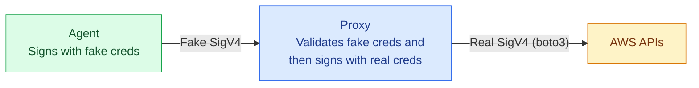
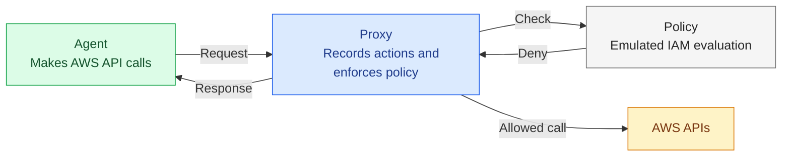

# IAM Agent Proxy

IAM Agent proxy is a *credential injection proxy* that supports IAM policy generation and enforcement for *least privilege guardrails*.

## Credential injection proxy

**Agent** uses fake AWS keys and the **Proxy** re-signs outbound requests with real ones.




## Least privilege guardrails

**Proxy** resolves every outbound AWS request to IAM action and logs them. **Agent** runs a representative workload, builds observed **Policy** which is applied by Proxy to lock-in behavior.



## Quickstart

### Prerequisites

- Python 3.12
- AWS credentials configured for whatever role you want the proxy to re-sign with (any source: SSO, `credential_process`, static keys, instance profile)

### Install

```bash
python3 -m venv venv
source venv/bin/activate
pip install -e .
```

### Step 1 — start the proxy

```bash
AWS_PROFILE=my-real-profile iam-agent-proxy
```

`AWS_PROFILE` tells the proxy which real AWS credentials to use when re-signing requests. Set it to any profile with the permissions your agent needs (SSO, assumed role, static keys, etc.). Without it the proxy has no credentials and returns a 503 on every request.

On first run the proxy generates `~/.iam-agent-proxy/ca.pem` and writes an `[profile iam-agent-proxy]` section into `~/.aws/config` with `credential_process = proxy-creds`. It removes the section on clean exit (Ctrl-C).

### Step 2 — make AWS calls

In a second terminal:

```bash
export AWS_PROFILE=iam-agent-proxy
export HTTPS_PROXY=http://localhost:8080

aws sts get-caller-identity
aws s3 ls
```

In the proxy terminal you'll see:

```
[14:32:01] ALLOWED  sts:GetCallerIdentity
[14:32:09] ALLOWED  s3:ListAllMyBuckets
```

### Step 3 — extract the observed policy

```bash
iam-agent-proxy policy
```

Actions are recorded to `~/.iam-agent-proxy/actions.log` while the proxy is running. `iam-agent-proxy policy` reads that file and emits an IAM policy JSON:

```json
{
  "Version": "2012-10-17",
  "Statement": [
    {
      "Sid": "ProxyRecordedActions",
      "Effect": "Allow",
      "Action": [
        "s3:ListAllMyBuckets",
        "sts:GetCallerIdentity"
      ],
      "Resource": "*"
    }
  ]
}
```

## How it works

```
~/.iam-agent-proxy/
  ca.pem        # CA cert generated on first run; trusted by the AWS SDK via [profile iam-agent-proxy]
  ca.key        # CA private key
  creds.sock    # Unix socket that vends proxy keypairs to proxy-creds
  actions.log   # IAM actions observed by the proxy

~/.aws/config
  [profile iam-agent-proxy]
  credential_process = proxy-creds   # written on startup, removed on clean exit
  ca_bundle = ~/.iam-agent-proxy/ca.pem
```

The proxy uses the boto3 default credential chain to obtain real AWS credentials for re-signing. It holds a single session for its lifetime so that botocore can refresh expiring credentials (SSO, instance profiles, assumed roles) without re-running provider discovery.

## Configuration

| Env var | Default | Description |
|---|---|---|
| `AWS_PROFILE` | boto3 default chain | AWS profile the proxy uses to re-sign requests (set when starting the proxy, not in the agent terminal) |
| `PROXY_SOCK_PATH` | `~/.iam-agent-proxy/creds.sock` | Unix socket path for credential vending |
| `PROXY_KEYPAIR_TTL` | `3600` | Proxy keypair lifetime in seconds |
| `PROXY_MODE` | `record` | `record` (forward all) or `enforce` (check allowlist) |
| `ALLOWLIST_PATH` | *(required in enforce mode)* | Path to IAM policy JSON allowlist |
| `ACTION_LOG_PATH` | `~/.iam-agent-proxy/actions.log` | Where resolved actions are written |

## Integration tests (Docker + elhaz)

A Docker-based integration test stack lives in [`tests/integration/`](tests/integration/). It uses [elhaz](https://github.com/61418/elhaz) as the credential source and runs a fully isolated agent/proxy pair. See [`tests/integration/README.md`](tests/integration/README.md) for setup and usage.
